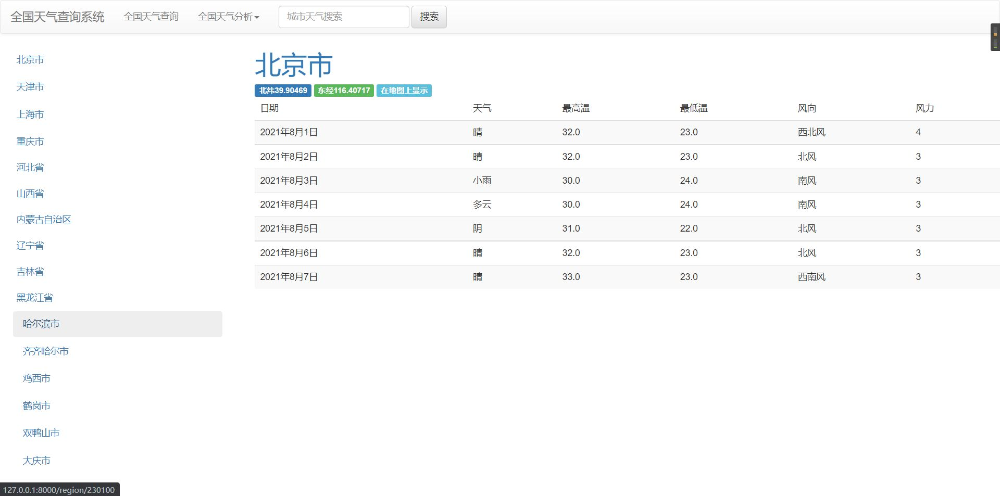
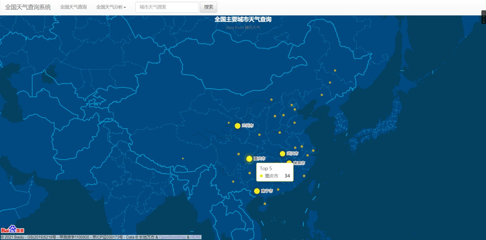

# 全国天气查询系统
长江大学2021大三暑期实训项目(Python)。

1. 基于腾讯天气获取天气数据,可通过城市名称/id爬取天气数据,将近7日天气显示出来。
2. 将全国重点城市的天气数据显示在地图上
## 0.项目预览


## 1.开发环境
- python 3.7.9
- django 3.1.5
- requests 2.26.0
```shell
pip install -r requirements.txt
```

## 2. 项目运行
```shell
python manage.py runserver
```
天气爬取基于腾讯天气接口,2021.8.5有效

## 3. 代码逻辑介绍
### Region类 Region.models.Region
区域类,将全国城市分为多级，如省，直辖市，市，区，县等。
### WeatherData类 WeatherData.models.WeatherData
天气数据类,存放天气数据,

### Weather.urls
存放项目所有的urls配置

### utils.update / utils.update_teacher
项目开发时的一次性脚本，主要用于Region类数据的导入和初始化

### utils.weather_spider
对天气数据进行爬取的工具类
- get_region_weather
根据区域获取天气数据
- update_region_weather
更新某区域的天气数据
- update_all
爬取全国重点城市的天气数据到数据库中，以方便地图显示，至少需要手动执行一次


